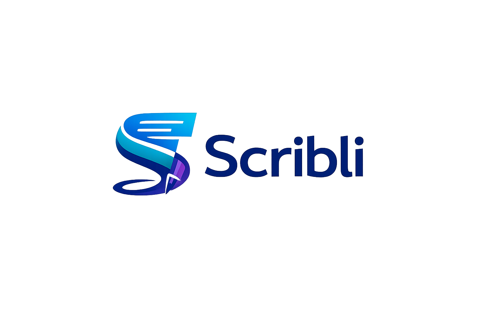

<p align="center">

<br>
<em>Local-first notes, documents, and personal knowledge management.</em>
</p>

# Scribli

Scribli is a local-first desktop knowledge workspace for writing, linking, outlining, querying, exporting, and maintaining long-lived personal notes. It is based on SiYuan, keeps the inherited AGPL-3.0 license, and is being reshaped into a self-contained application that does not depend on official upstream hosted services.

This repository contains the Scribli desktop/web frontend, Go kernel, and selected local Go dependency forks under `third_party/forks`. The application stores user data in a local workspace first. Optional sync is controlled by the user and points only at user-configured S3, WebDAV, or local-folder storage.

## Project Status

Scribli is a fork in active cleanup. The main desktop path builds and packages, but this repository still contains inherited architecture, file names, internal identifiers, comments, generated assets, and upstream source history. Upstream copyright notices in inherited source files must stay intact.

## Core Features

- Block-based editor with Markdown WYSIWYG behavior.
- Block references, backlinks, outlines, and document navigation.
- Attribute views and queryable local data.
- Local assets, file attachments, and export support.
- PDF, HTML, Word, Markdown, and asset-oriented export workflows inherited from the upstream project.
- Local snapshots, repository history, manual backups, and restore workflows.
- User-controlled sync through S3, WebDAV, or local-folder providers.
- Optional local HTTP API, WebSocket UI channel, plugin system, AI provider configuration, and MCP support when enabled or configured by the user.

## Local-First Behavior

Scribli creates and reads a workspace on the local machine. On Windows, the default workspace is:

```text
%USERPROFILE%\Documents\Scribli
```

Scribli also stores its workspace list and related local app configuration under:

```text
%USERPROFILE%\.config\scribli
```

The workspace contains notebooks, documents, assets, local configuration, indexes, snapshots, history, temporary files, and backups. Treat the whole workspace directory as user data.

## Network Behavior

A fresh Scribli workspace is intended to run without contacting official upstream hosted services. Official cloud login, account checks, subscriptions, payments, marketplace/bazaar access, official update checks, official cloud snapshots, and official cloud quota/status calls have been removed or disabled.

Scribli can still make network connections when the user configures or triggers local features that require them:

- S3 sync connects to the S3-compatible endpoint configured by the user.
- WebDAV sync connects to the WebDAV endpoint configured by the user.
- Remote asset import, web clipping, URL fetching, and similar tools connect to URLs supplied by the user or present in user content.
- AI features connect to providers configured by the user.
- MCP, plugin, API, WebDAV, CalDAV, and CardDAV server features can expose local services depending on configuration.

Runtime auto-update is disabled until Scribli has its own signed release process.

## Sync Providers

Provider `0` is disabled and must not perform network sync activity. It is retained as a configuration-compatible numeric value.

Supported user-controlled providers:

| Provider | Meaning | Network owner |
| --- | --- | --- |
| `0` | Disabled / no sync provider | None |
| `2` | S3-compatible storage | User-configured endpoint |
| `3` | WebDAV storage | User-configured endpoint |
| `4` | Local-folder sync | User-selected local path |

Do not place the active workspace inside a third-party cloud-drive folder such as OneDrive, Dropbox, Google Drive, iCloud Drive, or similar tools. Use Scribli's sync provider configuration or manual backups instead. File-level cloud drives can erase the database, indexes, locks, and snapshot files.

## What Was Removed From Upstream

Scribli intentionally removes or disables inherited behavior tied to official upstream services:

- Official upstream cloud provider.
- Official account login and account-dependent sync.
- Cloud account storage statistics.
- Official cloud snapshot upload and download.
- Official cloud backup listing.
- Official cloud repository purge.
- Official cloud traffic, quota, points, subscription, payment, and membership surfaces.
- Bazaar/community marketplace access.
- Upstream release checks and runtime auto-update install flow.
- Build-time Electron mirror forcing and upstream publishing workflows.
- Upstream Docker, AUR, and GitHub release publishing from this repository.

## Installation

Use a Scribli build produced from this repository or build locally. Current packaging produces a Windows installer at:

```text
app\build\scribli-<version>-win.exe
```

No official Scribli release channel is published from this repository yet. Until Scribli owns its release and signing pipeline, treat local builds as the source of truth.

## Development

Required tools:

- Go matching the `go` directive in `kernel/go.mod`.
- Node.js and pnpm matching `app/package.json`.
- On Windows, a C compiler is required for CGO kernel builds. The local setup has used `w64devkit`.

Install frontend dependencies:

```powershell
cd C:\Users\(user)\Documents\GitHub\note\app
pnpm install
```

Run frontend checks:

```powershell
cd C:\Users\(user)\Documents\GitHub\note\app
pnpm run lint
pnpm test
```

Run kernel tests from the kernel directory. On Windows with repo-local caches and `w64devkit`:

```powershell
cd C:\Users\(user)\Documents\GitHub\note\kernel
$env:PATH=(Resolve-Path "..\.tools\w64devkit\bin").Path + ";" + $env:PATH
$env:GOPATH=(Resolve-Path "..\.tools").Path + "\go-path"
$env:GOCACHE=(Resolve-Path "..\.tools").Path + "\go-build-cache"
$env:GOMODCACHE=(Resolve-Path "..\.tools").Path + "\go-mod-cache"
$env:CGO_ENABLED="1"
$env:CC=(Resolve-Path "..\.tools\w64devkit\bin\gcc.exe").Path
go test ./...
```

The kernel module path is `github.com/icha-senpai/note/kernel`. Scribli-owned local Go forks use `github.com/icha-senpai/note/third_party/forks/<name>` and are resolved by local `replace` rules in `kernel/go.mod`.

## Build Instructions

Build production frontend bundles:

```powershell
cd C:\Users\(user)\Documents\GitHub\note\app
pnpm build
```

Package the Windows desktop app:

```powershell
cd C:\Users\(user)\Documents\GitHub\note\app
pnpm run dist
```

The dist scripts use `--publish=never`, and `electron-builder*.yml` sets `publish: null`. Publishing remains disabled until Scribli has its own release pipeline.

If the packaged app cannot find the kernel, build or copy the Scribli kernel binary into `app\kernel` using the repository's current build scripts before running the packaging command.

## Workspace And Backup Guidance

- Back up the full workspace directory, not only individual `.sy` files.
- Keep manual backups outside the active workspace.
- Keep local-folder sync targets outside the active workspace and outside its parent directories.
- Save the repository key and any sync credentials in a password manager. Losing the repository key can make encrypted snapshots unrecoverable.
- Before experimenting with sync settings, make a manual backup of the workspace.

## Security Model

Scribli is designed around local ownership of data. Local workspace files, local configuration, user-configured sync storage, and user-configured providers are trusted by the application.

Important boundaries:

- Anyone with filesystem access to the workspace can read or alter local notes and assets unless the storage layer itself is protected.
- S3, WebDAV, and local-folder sync targets are user-controlled trust boundaries. A compromised sync target can corrupt or roll back synced data.
- The local HTTP API and local services should not be exposed to untrusted networks.
- AI provider keys, S3 credentials, WebDAV credentials, and similar secrets should be treated as sensitive user configuration.
- Plugins and snippets can execute code in the application context; install or author them with the same care as desktop extensions.

## License

Scribli is licensed under the GNU Affero General Public License v3.0. See `LICENSE`.

Because Scribli is based on SiYuan, inherited AGPL-3.0 obligations still apply. If you modify Scribli and provide it over a network or distribute binaries, you must provide corresponding source code under the AGPL-3.0 terms.

Do not remove upstream copyright notices from inherited source files.

## Upstream Attribution

Scribli is based on SiYuan by its contributors and upstream maintainers. The original project provided the Go kernel, Electron/web frontend, editor architecture, data model, and much of the feature surface that Scribli inherits.

This fork changes application identity, disables official upstream cloud/account/commercial services, removes upstream publishing paths, and documents the project as Scribli. It is an independent build.

## Known Limitations

- Some internal package names, source paths, generated artifacts, and compatibility names may still contain inherited upstream identifiers.
- Internal naming cleanup is gradual; see `docs/INTERNAL-NAMING.md` for which legacy names are preserved for compatibility.
- Mobile packaging is not currently a Scribli-owned release path.
- Docker publishing is disabled.
- Runtime updates are disabled.
- Official cloud, account, subscription, payment, and marketplace services are intentionally unavailable.
- Existing upstream workspaces may need careful backup and migration testing before day-to-day use with Scribli.

## Contributing

Contributions should keep Scribli local-first and independent from official upstream services. Before opening a change:

- Preserve AGPL-3.0 licensing and inherited copyright notices.
- Avoid adding telemetry, official upstream service calls, or automatic publishing.
- Keep S3, WebDAV, local sync, local snapshots, manual backups, API, MCP, and user-controlled provider behavior working.
- Run relevant checks before calling work ready.
- Document any new network behavior clearly.

For detailed repository guidance, see `AGENTS.md`.
